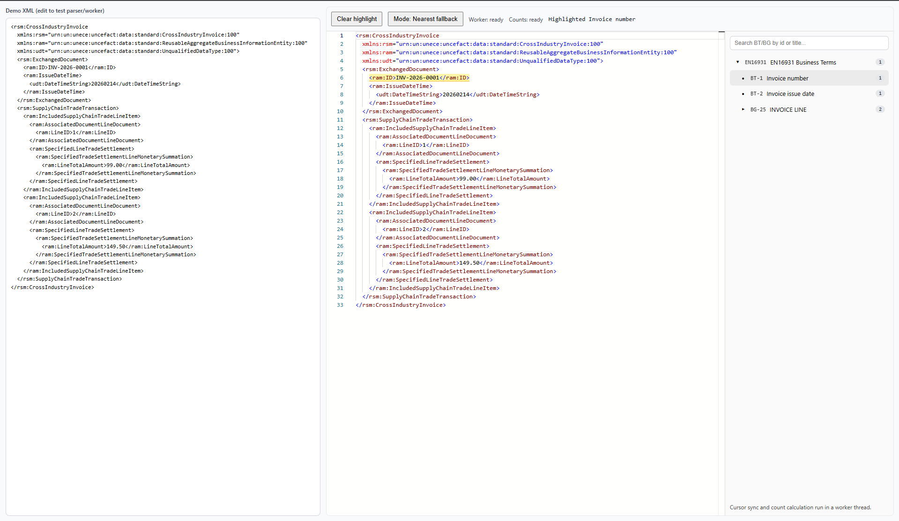

# xml-explorer

React XML explorer component with:

- Monaco XML editor
- worker-based XPath indexing and cursor lookup
- EN16931 BT/BG tree synchronization
- strict vs nearest mapping mode



## Usage

```tsx
import { XMLExplorer } from "xml-explorer";
import type { TreeNode, XmlNamespaces } from "xml-explorer";

export function Example() {
  const tree: TreeNode = loadYourTreeDefinition();
  const namespaces: XmlNamespaces = loadYourNamespaces();
  return (
    <XMLExplorer
      xml={xmlString}
      syntax="cii"
      tree={tree}
      namespaces={namespaces}
    />
  );
}
```


`xml-explorer` does not ship a built-in BT/BG catalog or namespace map. Consumers must provide `tree` and `namespaces`.
For example Tree and Namespace, see [here](src/assets/btTree.ts)

## Local development

```bash
npm install
npm run dev
```

The Vite app in this repo is a demo host for the package.

## Install (consumer app)

```bash
npm install xml-explorer
```

Required peer dependencies in the consumer app:

- `react`
- `react-dom`
- `@monaco-editor/react`
- `monaco-editor`


## Package API

- `XMLExplorer` (named export)
- `buildRuntimeTree`
- `buildMappingsForSyntax`
- types: `XmlSyntax`, `XmlNamespaces`, `TreeNode`, `RuntimeTreeNode`, `NodeMapping`, `MatchLocation`

## Build package

```bash
npm run build
```

Outputs are written to `dist/`:

- `dist/index.js` (ESM)
- `dist/index.cjs` (CJS)
- `dist/index.d.ts` (types)

## Dry-run before publish

```bash
npm pack
```

Inspect the generated `.tgz` to confirm package contents.

## Publish to npm

1. Ensure package name/version in `package.json` are correct.
2. Login once: `npm login`
3. Publish: `npm publish --access public`

If the package name is already taken, use a scoped name like `@your-scope/xml-explorer`.
